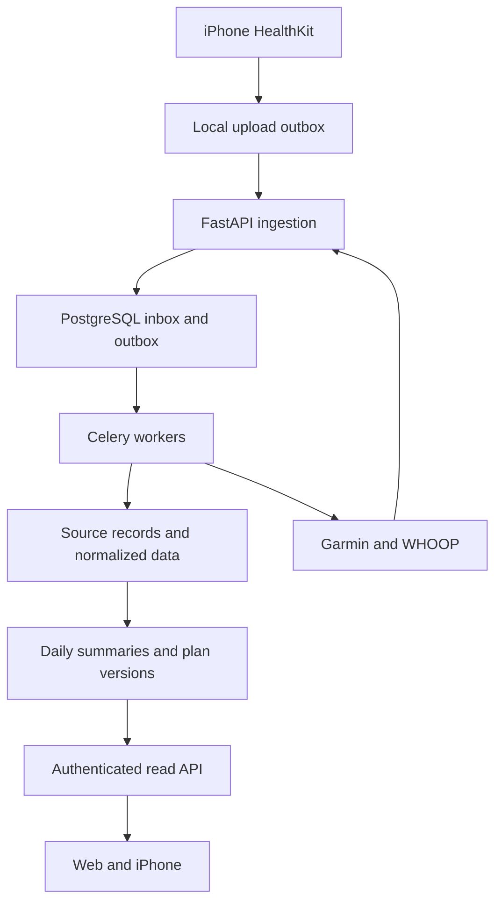

# EnduranceApp: Repository Review and Implementation Prompt

EnduranceApp has a useful interface and backend foundation, but the reviewed code is a prototype rather than a working service for multiple athletes. The recommended path is to retain Next.js, FastAPI, PostgreSQL, and the existing queue dependencies; establish authentication, persistence, and honest data states; then add an iPhone HealthKit companion and official Garmin and WHOOP integrations.

The product scope is **a web application plus an iPhone companion, using direct provider integrations**. Initial integration means importing existing workouts and health measurements after permission or account authorization. Recording workouts directly on a watch, streaming live sensors, and sending planned workouts to devices are separate later capabilities.

## 1. Product and code baseline

The supplied `IronmanAppDiagram(1).jpg` describes an endurance coach with account creation, a possible subscription, athlete and race onboarding, current swim/bike/run performance, device connections, a race countdown, and an evolving weekly training and nutrition plan. It includes full-distance triathlon, 70.3, sprint and Olympic triathlon, marathon, and half marathon. Treat the handwritten approximately $25/month price and product names as proposals, not final requirements.

The code baseline is the repository's `main` commit [`108edc72767765a484ba54c41437c35da8b2a9bc`](https://github.com/lilyecoan/EnduranceApp/tree/108edc72767765a484ba54c41437c35da8b2a9bc), committed September 9, 2026. Provider documentation and technical requirements below were checked through September 14, 2026. Recheck changed code and provider requirements before implementation.

The repository contains Next.js 16.2.7, React 19.2.4, TypeScript, Tailwind, FastAPI, Pydantic 2, SQLAlchemy, PostgreSQL, Redis/Celery dependencies, and a LangGraph coaching workflow. The workflow mostly runs ordinary Python rules, followed by a Gemini call; it is not seven independent LLM calls. These existing boundaries are sufficient for an initial modular application. A rewrite into microservices would add coordination work before resolving the current correctness problems.

### Highest-priority findings

Priority **P0** means resolve before connecting real athletes. **P1** means resolve before a reliable pilot. These are source findings against the pinned commit, not claims about an independently verified production deployment.

| Priority | Finding and consequence | Current code |
| --- | --- | --- |
| P0 | Coaching and Garmin snapshot routes have no authentication dependency. The coaching request accepts a client-supplied `user_id`, defaulting to `demo`. Athlete identity must come from a verified session. | [coaching.py](https://github.com/lilyecoan/EnduranceApp/blob/108edc72767765a484ba54c41437c35da8b2a9bc/backend/app/routers/coaching.py), [main.py](https://github.com/lilyecoan/EnduranceApp/blob/108edc72767765a484ba54c41437c35da8b2a9bc/backend/app/main.py) |
| P0 | Garmin uses one module-level service instance and server-wide email/password credentials through `garminconnect`. Every request reaches the same account context. This cannot provide isolated customer connections. | [garmin_service.py](https://github.com/lilyecoan/EnduranceApp/blob/108edc72767765a484ba54c41437c35da8b2a9bc/backend/app/services/garmin_service.py) |
| P0 | Backend login failures return sample data. The frontend also fills absent live fields with sample values, and any successful HTTP response enables the live badge. This can present fabricated measurements as current Garmin data. | [garmin_service.py](https://github.com/lilyecoan/EnduranceApp/blob/108edc72767765a484ba54c41437c35da8b2a9bc/backend/app/services/garmin_service.py), [garminApi.ts](https://github.com/lilyecoan/EnduranceApp/blob/108edc72767765a484ba54c41437c35da8b2a9bc/frontend/src/lib/garminApi.ts), [useGarminData.ts](https://github.com/lilyecoan/EnduranceApp/blob/108edc72767765a484ba54c41437c35da8b2a9bc/frontend/src/hooks/useGarminData.ts) |
| P0 | The head-coach prompt contains a fixed named athlete, medical conditions, race, and performance values. Dashboard advice is also hardcoded. These demo assumptions must never be attributed to another account. | [head_coach.py](https://github.com/lilyecoan/EnduranceApp/blob/108edc72767765a484ba54c41437c35da8b2a9bc/backend/app/agents/head_coach.py), [dashboard](https://github.com/lilyecoan/EnduranceApp/blob/108edc72767765a484ba54c41437c35da8b2a9bc/frontend/src/app/page.tsx) |
| P0 | Garmin mappings relabel a five-minute HRV high as nightly RMSSD, a baseline bound as a five-day average, and a load ratio as TSB. Other mappings guess units. These quantities need verified schemas and distinct definitions. | [garmin_service.py](https://github.com/lilyecoan/EnduranceApp/blob/108edc72767765a484ba54c41437c35da8b2a9bc/backend/app/services/garmin_service.py) |
| P0 | Performance classification reverses the direction of run/swim pace; the limiter selector chooses the strongest classification; the bike-time formula produces implausible race estimates. Empty recovery data produces a fatigue recommendation. | [performance_agent.py](https://github.com/lilyecoan/EnduranceApp/blob/108edc72767765a484ba54c41437c35da8b2a9bc/backend/app/agents/performance_agent.py), [recovery_agent.py](https://github.com/lilyecoan/EnduranceApp/blob/108edc72767765a484ba54c41437c35da8b2a9bc/backend/app/agents/recovery_agent.py) |
| P1 | Database models exist, but the coaching routes do not persist measurements or generated plans. The tree has no migration setup, authentication flow, integration webhooks, OAuth callbacks, iOS project, tests, or CI workflow. | [backend tree](https://github.com/lilyecoan/EnduranceApp/tree/108edc72767765a484ba54c41437c35da8b2a9bc/backend), [database base](https://github.com/lilyecoan/EnduranceApp/blob/108edc72767765a484ba54c41437c35da8b2a9bc/backend/app/db/base.py) |
| P1 | `Activity` has only a Garmin-specific external ID. Recovery descriptions are mapped as floats; profile one-to-one relationships lack corresponding uniqueness constraints; race `is_primary` is a string. These models need migrations and source-aware constraints. | [activity.py](https://github.com/lilyecoan/EnduranceApp/blob/108edc72767765a484ba54c41437c35da8b2a9bc/backend/app/models/activity.py), [recovery.py](https://github.com/lilyecoan/EnduranceApp/blob/108edc72767765a484ba54c41437c35da8b2a9bc/backend/app/models/recovery.py), [athlete.py](https://github.com/lilyecoan/EnduranceApp/blob/108edc72767765a484ba54c41437c35da8b2a9bc/backend/app/models/athlete.py), [race.py](https://github.com/lilyecoan/EnduranceApp/blob/108edc72767765a484ba54c41437c35da8b2a9bc/backend/app/models/race.py) |
| P1 | The weekly plan is never populated by the graph. Nutrition reads future-workout fields that the Garmin service never supplies. Weather fetching exists but is not connected to the executed workflow. Race logic hardcodes 70.3 distances. | [head_coach.py](https://github.com/lilyecoan/EnduranceApp/blob/108edc72767765a484ba54c41437c35da8b2a9bc/backend/app/agents/head_coach.py), [nutrition_agent.py](https://github.com/lilyecoan/EnduranceApp/blob/108edc72767765a484ba54c41437c35da8b2a9bc/backend/app/agents/nutrition_agent.py), [weather_agent.py](https://github.com/lilyecoan/EnduranceApp/blob/108edc72767765a484ba54c41437c35da8b2a9bc/backend/app/agents/weather_agent.py), [race_strategy_agent.py](https://github.com/lilyecoan/EnduranceApp/blob/108edc72767765a484ba54c41437c35da8b2a9bc/backend/app/agents/race_strategy_agent.py) |
| P1 | Dashboard dates, race predictions, weekly plans, nutrition, and profile content contain fixed/demo values. Settings starts Garmin as connected; its Save button does not persist settings. The API-key copy inaccurately describes storage and transmission. | [app pages](https://github.com/lilyecoan/EnduranceApp/tree/108edc72767765a484ba54c41437c35da8b2a9bc/frontend/src/app), [settings page](https://github.com/lilyecoan/EnduranceApp/blob/108edc72767765a484ba54c41437c35da8b2a9bc/frontend/src/app/settings/page.tsx) |
| P1 | The async coaching route directly invokes a synchronous graph and Gemini request. Long work belongs in the worker path; declaring the route async does not make that call nonblocking. | [coaching.py](https://github.com/lilyecoan/EnduranceApp/blob/108edc72767765a484ba54c41437c35da8b2a9bc/backend/app/routers/coaching.py), [FastAPI concurrency guidance](https://fastapi.tiangolo.com/async/) |
| P1 | Compose references a missing `app.core.celery_app`. It injects `OPENAI_API_KEY` while the implementation expects Gemini configuration. Frontend API environment names disagree. The frontend Dockerfile expects standalone output that Next config does not enable. Backend Docker starts with reload enabled. | [compose](https://github.com/lilyecoan/EnduranceApp/blob/108edc72767765a484ba54c41437c35da8b2a9bc/docker-compose.yml), [config.py](https://github.com/lilyecoan/EnduranceApp/blob/108edc72767765a484ba54c41437c35da8b2a9bc/backend/app/core/config.py), [frontend Dockerfile](https://github.com/lilyecoan/EnduranceApp/blob/108edc72767765a484ba54c41437c35da8b2a9bc/frontend/Dockerfile), [next.config.ts](https://github.com/lilyecoan/EnduranceApp/blob/108edc72767765a484ba54c41437c35da8b2a9bc/frontend/next.config.ts), [backend Dockerfile](https://github.com/lilyecoan/EnduranceApp/blob/108edc72767765a484ba54c41437c35da8b2a9bc/backend/Dockerfile) |

Isolated synthetic checks reproduced the numerical defects below. These checks bypassed the unavailable graph dependency and exercised the ordinary Python functions; they are not end-to-end application tests.

| Synthetic input | Actual result at the reviewed commit | Required correction |
| --- | --- | --- |
| Run 240 seconds/km and swim 80 seconds/100 m | Both classified beginner; slower values of 450 and 150 respectively classified elite | Correct direction, then validate any classification model and thresholds before exposing it |
| FTP 280 W, body mass 70 kg, run 240 seconds/km | Estimated finish approximately 835.48 hours; bike labeled the primary limiter despite being classified elite | Remove invalid estimator and limiter logic; require validated event-specific models |
| Empty recovery snapshot | Score 50 and an intensity-reduction recommendation | Missing-data state without a fabricated readiness assessment |
| No swim pace | Race strategy returns 103 seconds/100 m | Unknown target until an appropriate input exists |
| 70 kg and no workout fields | Daily calories 1,960; calories implied by returned macros 2,065 | Consistent arithmetic and nutrition derived from the actual planned session |

Thirty Python files passed syntax parsing. The review does not establish that Docker startup, full dependency installation, provider OAuth, iPhone background execution, or production deployment works. No live health account or real provider credentials were used for these checks.

## 2. Recommended integration choices

### Provider comparison

| Provider | Recommended connection | Useful initial data | Constraints and product wording |
| --- | --- | --- | --- |
| Apple Watch / Apple Health | Native iPhone HealthKit permission flow; companion uploads permitted records to FastAPI | Workouts, available workout metrics, heart rate, resting heart rate, sleep, and appropriately identified HRV | HealthKit is a native store, not a website OAuth feed. Existing Watch data can be read after it reaches HealthKit; a custom watchOS app is unnecessary for this first scope. Say **Connect Apple Health on iPhone**. [^1] |
| Garmin | Official Garmin Connect Developer Program OAuth 2.0; Activity API and approved Health API feeds | Activity details and files; permitted daily health and recovery summaries | Business approval is required. General program access and particular commercial metric licensing have different fee conditions. Exact portal contracts remain an implementation dependency. Say **Connect Garmin**. [^5], [^6], [^7] |
| WHOOP | Official Developer API v2 OAuth 2.0 plus webhooks and reconciliation | Workouts, sleep, recovery, physiological cycles, and optional body measurements | v1 is unsupported. Development apps are limited to 10 WHOOP members before wider approval. Production storage and AI use require the terms decision below. Say **Connect WHOOP**. [^9], [^10] |

For all three, connecting grants access; it does not guarantee that every metric exists or that the device has finished syncing. The onboarding screen should explain the provider-specific next action, show the last successful import, and remain useful with manual training entries.

A third-party aggregation platform is not part of this scope. Reconsider one only if provider approval or engineering capacity changes the commercial case. It would still require examining data rights, native HealthKit collection, coverage, latency, deletion support, and vendor dependence.

### WHOOP commercial and data-use decision

WHOOP's public terms restrict competing services (§3.1.13). Section 4.2 restricts permanent copies, database building, cache duration, and derived uses **unless expressly permitted by the data owner or applicable law**. Section 7 requires deletion when access or the agreement terminates. These are material to an AI coaching service that stores longitudinal data; they do not by themselves establish that this specific app is prohibited. [^16]

**Recommendation:** obtain documented clarification covering this commercial coaching use, retention of original and derived data, and disclosure to an AI processor before enabling the production WHOOP pipeline. User authorization should not be assumed to resolve every right in WHOOP-generated scores. The adapter can be implemented with synthetic fixtures while the permitted production policy is established. This is a provider-specific release dependency, not a reason to stop other engineering work.

### Current API details that affect implementation

Apple incremental queries provide additions and deletions through opaque anchors. Native background execution is opportunistic, so an iPhone must retain pending uploads and catch up in the foreground. Reading zero samples does not prove that read permission was denied: HealthKit deliberately does not expose read authorization in the same way as write authorization. [^2], [^3], [^4]

Garmin's Activity API is needed for workout history; the existing daily snapshot is not an activity import. Public documentation describes push or ping/pull delivery and backfill tooling. Exact endpoint URLs, notification verification, quotas, and historical windows should come from the approved developer portal. Sending planned sessions uses a separate Training API capability. [^6], [^8]

WHOOP's default limits are 100 requests/minute and 10,000/day **per client**, so a scheduler must budget across all connected members. An initial history import cannot consume the capacity needed for current changes. [^14]

---

## 3. Copy-ready implementation prompt

Use the instructions below as the engineering brief. The repository findings and provider decisions above are part of the brief; verify them against the checkout before editing.

### Role and outcome

Act as a senior engineer responsible for evolving `lilyecoan/EnduranceApp` into a reliable endurance-coaching application. Implement a web application and a native iPhone companion, with direct Apple HealthKit, official Garmin, and WHOOP v2 integrations. Preserve useful interface components and the existing Next.js/FastAPI/PostgreSQL foundation.

Deliver working, reviewable increments with migrations, meaningful tests, and accurate setup instructions. Distinguish implemented behavior, simulated behavior, and external dependencies. Never present fixture-based tests as proof of a production connection.

Start by inspecting the current checkout, working-tree changes, `AGENTS.md`, dependency versions, and relevant code. The existing `frontend/AGENTS.md` requires reading the installed Next.js guides in `node_modules/next/dist/docs/` before writing frontend code. Resolve changes since the reviewed commit before applying this brief. Avoid overwriting unrelated work.

### A. Build the account and onboarding foundation

Implement one application identity shared by web and iPhone. Select a maintained authentication solution compatible with FastAPI and native authorization; document its configuration and ownership model. Do not create a custom password protocol or place provider credentials in the browser. Separate authentication to EnduranceApp from authorization to Garmin or WHOOP.

Derive the athlete ID from the verified application session or token for every private request. Remove the public `user_id="demo"` behavior. Enforce ownership on every profile, activity, integration, plan, export, and background-job operation. A UUID being difficult to guess is not an authorization check. [^20]

Use secure HttpOnly cookies with CSRF protection where browser cookies authenticate requests. Validate token signature, issuer, audience, expiration, and intended client where bearer tokens are used. Native sign-in should use the system authorization browser and secure token storage. Keep provider tokens separately encrypted on the backend.

Persist onboarding progress and allow resumption. Collect the minimum information required for useful training planning: preferred units and timezone, race type/date and goals, recent training consistency, available days and weekly hours, current sessions, relevant equipment, rest constraints, and optional recent performance tests. Explain whether a pace is a race result, easy pace, or threshold estimate; do not combine these meanings.

Make medical conditions, injuries, body measurements, and dietary restrictions optional and purpose-specific. Remove the fixed medical profile from ordinary accounts. Do not infer a condition from wearable readings. Allow skipping device setup and using manual sessions, perceived exertion, and subjective readiness. Support multiple races with one explicit primary goal.

Keep subscription price and the payment step configurable. Provide a useful onboarding preview before requiring a device connection. Do not make an absent recovery metric block account setup.

### B. Replace sample/live ambiguity with explicit contracts

Move fixtures into an unmistakable demo mode, unavailable to ordinary production data paths. Remove backend mock fallbacks and the merge of mock fields into live responses in `garminApi.ts`. Replace types inferred from mock objects with Pydantic/OpenAPI contracts and generated TypeScript types.

Represent **connection**, **sync progress**, and **measurement availability** independently. A valid token does not establish a successful import; a successful import does not mean today's sleep or HRV exists.

Suggested connection states are `disconnected`, `authorizing`, `connected`, `reauth_required`, `revoked`, and `unavailable`. Suggested sync states are `idle`, `queued`, `running`, `partial`, `failed`, and `complete`. A metric should support `available`, `no_data`, `pending`, `unsupported`, and `withheld`; freshness should be a separate field. Only assert `withheld` where the platform actually reveals that fact.

Use an envelope along these lines, adapting it to the final schema:

```typescript
type Metric<T> = {
  value: T | null;
  unit: string | null;
  availability: "available" | "no_data" | "pending" | "unsupported" | "withheld";
  freshness: "current" | "stale" | "unknown";
  observedAt: string | null;
  periodStart: string | null;
  periodEnd: string | null;
  importedAt: string | null;
  sourceRecordIds: string[];
  sourceProvider: "healthkit" | "garmin" | "whoop" | "manual";
  measurementMethod: string | null;
  qualityFlags: string[];
  calculationVersion: string | null;
};
```

Require missing values to be null with a reason. Preserve legitimate zeros; replace inappropriate `value or fallback` logic with explicit null checks. Show source and measurement time in the interface, plus last successful synchronization in connection settings. Use copy such as “No recent sleep data” or “Waiting for iPhone sync” rather than an invented score.

Remove static race dates, countdowns, coaching narratives, profile fields, charts, and settings-success behavior from normal account pages. Derive them from persisted data. An API outage should preserve a clearly dated last-known result or display an unavailable state. It must not activate a live badge.

### C. Use a modular backend and a thin iPhone companion

Keep one FastAPI application with modules for accounts, integrations, ingestion, activities, measurements, planning, and billing. Use PostgreSQL as the durable source of truth and the existing Celery/Redis stack for asynchronous work. Avoid introducing Kafka, Kubernetes, multiple databases, or a separate service per provider before demonstrated need.

Add a small native Swift/SwiftUI iPhone project focused on application sign-in, HealthKit permissions, synchronization status, and connection help. A full native copy of every dashboard page is unnecessary initially. A future watchOS recorder can be designed separately.

The data flow should be:



Authenticate and durably record incoming work before expensive processing. The dashboard should read local summaries; opening it must not initiate a chain of provider requests or an LLM call.

Use a provider adapter interface with explicit capabilities: authorization support, granted feeds, paginated history, changed-record retrieval, deletion semantics, revocation, and supported metric definitions. HealthKit implements authenticated batch ingestion, not cloud OAuth. Avoid forcing all providers into identical capabilities.

### D. Model identity, provenance, and persistence correctly

Create versioned Alembic migrations rather than relying on model declarations. Introduce the following logical entities; combine tables where it reduces complexity without losing constraints.

| Entity | Essential responsibility and constraint |
| --- | --- |
| Application user and athlete profile | Verified identity; a database-enforced unique athlete profile per user where one-to-one is intended |
| Provider account | Stable provider subject associated with the application owner; never match accounts by email alone |
| Connection grant | Provider account, scopes, status, encrypted token reference, expiry, authorization generation, and authorization timestamps |
| Native installation binding | Application user, installation identity, enrollment status, and generation used to authorize iPhone uploads |
| Source record | Owner, provider account/source namespace, resource type, external ID, source timestamps/version if available, import time, payload hash, deletion state, and schema version |
| Normalized activity | Canonical sport, times, duration, distance, measurements, source links, and any multisport parent/leg relationships |
| Measurement and sleep episode | Metric/method, source, units, period, availability, quality, and optional physiological-cycle relationship |
| Inbox, jobs, and outbox | Durable event identity, payload or pointer permitted by policy, processing status, attempts, lease, and next attempt time |
| Sync checkpoint | Connection/resource/query scope, bounded history window, continuation token, successful checkpoint, and reconciliation state |
| Daily summary | Owner, applicable local date, timezone policy, selected sources, calculation version, and input revision |
| Plan and plan version | Goal race, effective week, structured sessions, immutable revisions, input snapshot, decision reasons, and approval state |
| Workout completion link | Planned session to canonical activities, allowing several recordings or multisport legs without double counting |
| Consent and retention policy | Authorized purposes, source-specific storage/AI permissions, consent revision, and deletion obligations |

For cloud imports, enforce uniqueness equivalent to `(owner_id, provider_account_id, resource_type, external_id)`. Reconnecting the same provider account must not create a second dataset. If an account is already bound to a different application user, require an explicit supported account-transfer flow; never silently transfer it.

For HealthKit, use an owner-scoped source namespace and the sample UUID/resource type for exact duplicate detection. Installation ID belongs in delivery provenance and authorization, not in a uniqueness key that would duplicate the same sample when a second phone uploads it. Do not collect Apple ID as an account-linking shortcut.

Preserve source records separately from a canonical activity. A normalized value should be traceable to its input record and transformation version. Store raw payloads only where the provider policy and consent permit them, with explicit expiry. Keep large permitted activity files in encrypted object storage if needed, referenced by PostgreSQL. The core database must remain useful without unlimited raw-file retention.

Use database transactions and unique constraints for concurrent upserts; an application-level “check then insert” is insufficient. PostgreSQL `ON CONFLICT` provides the necessary atomic primitive. [^22]

Add appropriate owner/time indexes and enforce foreign-key ownership boundaries. If row-level security is adopted as defense in depth, test pooled-connection context and use a runtime role that cannot bypass the policies. Table owners and privileged roles can bypass ordinary RLS, so merely enabling it does not establish isolation. [^21]

Fix the reviewed model defects: string recovery descriptions must not be floats; true/false flags must be booleans; one-to-one relationships need uniqueness; planned workouts need more than a single completion boolean. Specify units in schema names or explicit unit fields.

### E. Implement Apple HealthKit synchronization

Create the native HealthKit entitlement and clear purpose descriptions. Request read access only to types needed for enabled features, initially workouts and selected supporting measurements. Request additional categories when their purpose becomes visible. Leave write access, route location, and detailed high-volume samples outside the initial scope unless a feature requires them.

Use the current Apple SDK declarations and physical-device testing to implement `HKObserverQuery`, incremental `HKAnchoredObjectQuery`, and supported background delivery. Query authorization completion is not proof that read access was granted. Keep the no-data experience neutral and offer instructions to review access in Health settings. [^1], [^4]

Implement this local durability contract:

1. Bind synchronization to the currently signed-in EnduranceApp account and an enrolled installation generation.
2. Maintain each opaque anchor by account, installation, HealthKit type, and a fixed query/predicate version. Do not reuse an anchor across incompatible predicates or accounts.
3. Read bounded pages of additions and deletions. Preserve sample UUID, source application/device metadata where available, measurement method, time interval, units, and permitted workout associations.
4. In one local transaction, save the upload batch to a protected outbox and advance the matching local anchor. If that transaction fails, neither advances.
5. Complete the observer callback after bounded local handling and durable recording; do not hold it indefinitely waiting for an internet upload. Follow Apple's completion and background-delivery requirements for the selected SDK.
6. Upload persisted batches with an idempotency key and installation generation. The backend returns success only after durable acceptance. Delete local queued payloads only after acknowledgment.
7. Resume failed uploads without repeating already acknowledged effects. Run foreground catch-up at app launch and when returning to the app; treat background delivery as best effort.

Apple anchors are local change checkpoints, not timestamps or server-side credentials. Incremental-query additions and deletions are the platform mechanism; the local transactional outbox above is the recommended reliability design. [^2]

Keep a permitted sample-to-summary mapping so a deletion containing a UUID can invalidate the affected activity or date. An old upload must not resurrect a deleted sample. A reinstall or lost local anchor can require a bounded rebuild; backend source uniqueness must make reimport safe. After an account switch, invalidate the old binding and isolate or discard its pending uploads according to the sign-out policy. Never relabel an old batch with the newly signed-in user.

Use HealthKit statistics APIs for supported cumulative quantities rather than blindly summing samples from multiple devices. Keep the distinction between an aggregate and its contributing source samples. Workouts and sleep still need their own overlap and provenance rules; cumulative step handling is not a universal duplicate-removal algorithm. [^1]

Test locked-device behavior, offline operation, denied or partial access, a changed permission selection, multiple recording apps, deleted workouts, interrupted uploads, reinstalls, and account switching. Select protected local storage and backup exclusions compatible with the chosen background behavior. The interface must communicate that phone/watch synchronization and iOS scheduling can delay arrival. [^3]

### F. Replace the Garmin login prototype with the official integration

Remove `GARMIN_EMAIL`, `GARMIN_PASSWORD`, the shared login session, and `.garmin_tokens` from the real-user architecture. Retain any old demo path only as a clearly isolated, disabled fixture. Do not collect Garmin account passwords in EnduranceApp.

Implement official Garmin Connect OAuth 2.0 following the approved developer portal. The public FAQ explicitly identifies OAuth 2.0; do not copy older OAuth 1.0a examples. Confirm the exact feeds and commercial metric terms granted to this application. [^5]

Use Activity API data for completed workouts and approved Health API data for daily measurements. Preserve external activity IDs and parse supported activity files only when their detail is necessary. Implement notification authentication, push or ping/pull handling, backfill, deauthorization, and rate limiting against the actual portal contract. Do not invent a universal Garmin webhook signature or endpoint from another provider's behavior. [^6], [^7]

Create a field-mapping document with the exact official field, definition, unit, optionality, and normalized destination. Quarantine unknown payload revisions rather than silently mislabeling them. Explicitly eliminate the reviewed HRV, load-ratio/TSB, Body Battery, and guessed-unit mappings. Expose only metrics available for the authorized feed and device.

Where portal access is pending, implement the interface, synthetic fixtures, and connection status `unavailable` with a specific setup reason. Keep account authentication, database migrations, HealthKit, and UI work progressing. Do not mark Garmin connected until authorization succeeds, and do not mark data current until an import succeeds.

Workout export is a later, independently enabled feature using Garmin Training API approval and explicit user intent. Importing activities is not equivalent to sending a training plan to a watch. [^8]

### G. Implement WHOOP v2 with correct identities and events

Enforce the production permission decision from section 2 before retaining real WHOOP data or forwarding it to AI. Encode the allowed policy in configuration with documented approval evidence; default to disabled if that policy has not been established. Apply allowed retention to normalized data, derived summaries, prompts, caches, and files as well as raw payloads.

Use server-side OAuth authorization-code exchange. Request `offline` for refresh capability and only required read scopes. Separate provider credentials from application session credentials. WHOOP rotates refresh tokens; serialize refresh per connection and atomically replace the token pair with a revision check so simultaneous jobs cannot overwrite a newer grant. [^11], [^12]

Use the v2 base `https://api.prod.whoop.com/developer/v2`. Relevant resources include `/user/profile/basic`, `/activity/workout`, `/activity/sleep`, `/cycle`, `/recovery`, and `/cycle/{cycleId}/recovery`; access revocation uses `DELETE /user/access`. Use required read scopes including `read:profile`, `read:workout`, `read:sleep`, `read:cycles`, and `read:recovery` only for enabled features; body measurement access is optional. Follow collection `next_token` into request `nextToken`; current collection page size is at most 25. Serialize numeric provider IDs safely across JavaScript boundaries. [^13]

Store workout and sleep UUIDs without converting them to integers. **A v2 recovery webhook identifies the associated sleep UUID, not a cycle ID.** Resolve that sleep's cycle relationship and fetch the corresponding cycle recovery. Retain the necessary sleep-to-cycle mapping for deletion handling. Never invent `/recovery/{sleepUUID}`. The migration guide contains legacy passages, but its explicit deprecation notice says v1 is unsupported; use the current v2 resource contract. [^9]

Implement updated/deleted handling for workouts, sleeps, and recovery. Verify `X-WHOOP-Signature` over the exact bytes using Base64 HMAC-SHA256 with the client secret and the timestamp header concatenated with the raw request body. Validate `X-WHOOP-Signature-Timestamp` according to the current provider header contract, using constant-time comparison and tested replay handling. Do not reserialize JSON before verification. Use `trace_id` as part of notification deduplication. Acknowledge within WHOOP's approximately one-second expectation after durable acceptance, then fetch current resource data in workers. Delivery can be duplicated, missed, or unordered; reconciliation remains necessary. Cycle/day-strain and body-measurement changes need appropriate polling because those resources lack corresponding webhook coverage. [^15]

Implement a client-wide budget from rate-limit headers and configurable ceilings, with current changes prioritized over historical imports. Treat repeated 429 responses as a scheduling problem; do not retry every user immediately. Request expanded limits through the supported process if measured demand requires them. [^14]

Preserve score state (`SCORED`, `PENDING_SCORE`, `UNSCORABLE`) and missing score objects. A WHOOP cycle is physiological and may span calendar boundaries; it is not the same entity as a local-date summary. Use the documented `sport_name` field rather than relying on removed legacy `sport_id`/`v1_id` fields. Do not promise arbitrary raw sensor streams from summary resources. [^17], [^18], [^19]

### H. Make synchronization durable and recoverable

For OAuth generally, bind each authorization attempt to the authenticated user, provider, approved redirect, one-time state, and short lifetime. Prevent callback replay and account swapping. Use authorization-code flow and PKCE with S256 where supported; public-client flows require appropriate PKCE protection. Verify provider-specific state constraints and PKCE support rather than assuming every provider exposes the same options. [^23]

Use **at-least-once delivery with idempotent effects**. Do not promise exactly-once delivery across a phone, a vendor webhook, Redis, and PostgreSQL.

For incoming notifications, verify authenticity, enforce size/schema limits, resolve the currently authorized provider account, and record the inbox event plus an outbox job in one database transaction. Return success after commit. An outbox dispatcher publishes work to Celery; periodic recovery republishes committed but unfinished work. Redis losing a message must not erase the only record of a pending import. This applies the transactional-outbox pattern to the existing stack. [^24]

For each worker operation:

1. Acquire a bounded lease scoped to the connection/resource or source record, as appropriate.
2. Recheck connection authorization generation, policy, scopes, and job state before network access and before committing results.
3. Fetch a bounded page or resource with timeouts. Refresh credentials through the shared refresh coordinator when needed.
4. Validate and normalize the payload. Preserve known source versions and explicit deletions; do not use arrival order as the only freshness rule.
5. In one transaction, upsert source records, update affected normalized records, persist permitted payload references, mark the page/event processed, advance the checkpoint, and emit recalculation work.
6. Recompute only affected summaries and plan inputs, then release the lease. A retry should reproduce the same visible outcome.

Treat an event without a trustworthy revision as an invalidation signal: fetch authoritative current state, serialize conflicting work, and protect deletion tombstones. Never let a delayed backfill overwrite a newer update. A 404 is a deletion only where the provider's resource semantics and authorization context establish that interpretation; an expired token or transient failure is not proof of deletion.

Separate bootstrap history, ordinary changes, and reconciliation. Make history windows configurable and bounded by actual provider permissions and retention rules. Import recent useful data first, show progress, and continue older permitted history in lower-priority batches. Resume from committed page boundaries. Do not assume a date filter represents `updated_at`; many filters select when an activity occurred.

Reconcile overlapping recent windows to repair missed notifications and schedule a bounded older-record audit or explicit resync where supported. Define what historical corrections can be detected under the provider's API and retention limits. A recent-window poll alone cannot guarantee discovery of every edit to an old workout. Absence from an incomplete page, filtered result, or revoked feed must not trigger mass deletion.

Use exponential backoff with jitter for transient errors, provider reset guidance for throttling, and explicit reauthorization states for invalid grants. Bound attempts and send persistent failures to a durable review/dead-letter state. Avoid unlimited retries for malformed payloads. Redact sensitive data from errors and traces.

On disconnect, stop new work, invalidate the connection generation, and attempt provider revocation when supported. Invalidate queued jobs and deny late native batches. Execute the source-specific deletion/retention policy, remove derived contributions as required, and clear dashboard caches. Document backup expiry and restore-time deletion replay. A restored backup or delayed job must not reactivate a revoked grant or recreate deleted user data.

### I. Prevent duplicate workouts and incompatible metric mixing

Implement two layers of deduplication. First, exact source identity makes redelivery harmless. Second, canonical activity matching links different source records that describe the same real session.

Use source application/device metadata and provider IDs to identify original recordings and mirrored imports. Allow the athlete to choose a preferred workout source, potentially by sport. Prefer original recording quality and available detail rather than imposing one global brand ranking. For example, Garmin may be the primary cycling recorder while Apple Watch is the primary running recorder and WHOOP supplies a separate recovery measure.

Candidate matching may use owner, compatible sport, time overlap, duration, and distance with tested tolerances. Preserve both source records and a reversible link. Automatically link only high-confidence matches; expose ambiguous cases for review. Do not merge two nearby sessions solely because their start times are close.

Represent triathlon and brick sessions with parent/leg relationships. Count either the parent total or the component totals according to an explicit aggregation rule, never both. Support transitions and multiple recordings without turning one workout into several days of load.

Keep field-level provenance when enriching an activity. Avoid switching between moving and elapsed time, or combining distance and duration from unrelated recordings. Never add daily steps, sleep, calories, or provider load scores across overlapping sources. Select or reconcile a source for each well-defined metric and show its origin.

Separate HRV methods and sampling contexts. Apple's HealthKit HRV type is SDNN; WHOOP documents RMSSD. Keep method-specific baselines and units instead of averaging the two into a single unexplained HRV number. Likewise, proprietary readiness, Body Battery, recovery, strain, and load measures are separate concepts until a validated transformation exists. [^25], [^17]

### J. Handle time, units, and changing data explicitly

Store event instants in UTC and retain source offsets/timezone information when supplied. Persist the athlete's IANA timezone for scheduling. Define whether historical daily summaries follow the event's local date or the athlete's current timezone; do not silently move past workouts when someone travels.

Preserve sleep intervals across midnight and WHOOP physiological cycles independently of calendar days. Test daylight-saving transitions, ambiguous local times, midnight crossings, race travel, and a changed home timezone. Store date-only race goals as dates with their event timezone when needed.

Normalize distance to meters, duration to seconds, mass to kilograms, power to watts, and pace to an explicitly documented representation. Convert for display at the edge. Record measurement methods and calculation versions so changed formulas can be backfilled consistently.

Run weekly planning by each athlete's local Monday and selected delivery time. Make the scheduling operation idempotent by athlete, local week, and input revision. A second scheduler or a daylight-saving transition must not create duplicate plans. Let late data create a new proposal version rather than silently modifying an already accepted week.

### K. Rebuild coaching around validated inputs and persisted plans

Replace the current fixed-profile head-coach prompt with an authenticated athlete snapshot assembled from persisted records. Include data age, missing inputs, selected sources, current plan, recent completed sessions, subjective feedback, race goal, and availability. Never fill missing athlete attributes with another person's demo values.

Separate numerical calculations from LLM explanations. Implement deterministic, typed functions for unit conversion, activity totals, training summaries, schedule constraints, and validated feature calculations. Document every derived metric's definition and expected inputs. Do not call a provider load ratio TSB or create CTL/ATL/TSS merely because similarly named UI cards exist.

Remove the existing race-time estimate until a defensible event-specific model is available. Correct direction and missing-data handling in pace comparisons; do not ship athlete-level labels without validation. A performance limiter should represent a supported weakness relevant to the goal, not the best-ranked sport. Handle triathlon and running events according to their actual legs and distances.

Do not label missing recovery data as fatigue or reassurance. Show insufficient evidence, use the established plan and subjective check-in appropriately, and avoid increasing intensity based on absent measurements. Readiness measures should inform a reviewed rule set, not serve as diagnosis or a universal automatic training command. Do not present `readiness / 100` as a calibrated confidence probability.

Use this planning order:

1. Validate athlete context and source quality.
2. Build a stable snapshot of completed training and current constraints.
3. Generate structured candidate sessions from a reviewed training policy.
4. Validate the complete week for availability, race specificity, rest constraints, recent history, and approved safety rules.
5. Derive general nutrition support from those planned sessions and declared preferences.
6. Generate an optional concise explanation grounded in the validated plan and cited evidence.
7. Validate the final structured output and save a new plan version with its input revision and reasons.

Retain LangGraph only where its state transitions make the workflow easier to maintain; ordinary domain functions are adequate for straightforward calculations. Do not add an LLM call per metric or per page render. If an LLM is unavailable or returns invalid output, retain a valid deterministic result or report that no new plan was generated. Never use a fabricated plan as the fallback.

Populate a typed `weekly_plan` with session IDs, sport, scheduled local time/date, duration, appropriate intensity targets, purpose, dependencies, and completion links. Keep planned and completed workouts separate. Save changes as immutable versions with optimistic concurrency checks, so late imports and manual edits do not overwrite each other.

Generate a Monday proposal with a readable comparison to the current plan. Let the athlete accept, adjust, or decline changes. Preserve manual changes unless explicitly replaced. Treat any urgent safety-related recommendation as a separate visible message under a reviewed policy; do not silently rewrite the week or permit an LLM to override deterministic constraints.

Fix nutrition data flow so it reads the accepted or proposed workout being discussed. Validate macro/calorie consistency, units, and missing information. Weather should enter through an explicit weather service with a location choice and timestamp if that feature is enabled; it should not be expected inside a Garmin snapshot. Keep clinical nutrition, insulin dosing, medication changes, and diagnosis outside this release.

### L. Use a reviewed evidence collection and a suitable AI service configuration

Replace the hardcoded reference summaries in `reference_service.py` with a small curated evidence collection. Record publisher, title, original URL, publication/update date, relevant population, permitted use, exact supporting section, review date, and supported claim IDs. An explanation should cite the claims it actually uses.

Treat Google Scholar as a discovery service, and WebMD or race websites as particular sources whose relevance must be evaluated. A URL list is not a verified knowledge base. Do not scrape these sites on every login or let search snippets establish medical recommendations. Retrieve only licensed or otherwise permitted content, and have qualified reviewers approve training/nutrition rules before they influence real plans.

Source documents, activity descriptions, and imported notes are untrusted data. Keep them out of instruction roles, constrain model tools, and validate outputs independently. Do not allow retrieved text to authorize exporting data or changing a plan. Keep private athlete information out of shared retrieval indexes and model-training datasets.

For food composition, USDA FoodData Central offers a documented API. It can support a separate food catalog; it does not supply personalized endurance or clinical prescriptions. Cache reusable catalog data separately from private athlete records and keep API credentials on the server. [^26]

Migrate the repository's legacy `google-generativeai` dependency to the supported `google-genai` SDK if Gemini remains selected. Google marks the legacy libraries deprecated as of November 30, 2025. Replace the unverified `gemini-1.5-pro` default with a configurable, account-available model validated against current availability and deprecation notices. Do not hardcode a new model solely from an old example. [^27], [^28]

Google's current terms prohibit clinical practice and medical-advice uses. They also restrict sensitive/personal submissions to unpaid services and describe different paid-service processing, with jurisdiction-specific provisions. Before sending athlete data, select a permitted service configuration, review the applicable processing terms, minimize inputs, and obtain the required consent. Paid access does not authorize a prohibited clinical use. Keep the initial Gemini-backed product for adults unless the age and service strategy is deliberately changed. [^29]

Remove the consumer Gemini-key field and inaccurate `.env` claim from settings for a managed subscription product. Store the service credential centrally in a secret manager and expose only meaningful AI controls: whether explanations are enabled, what information is shared, and how to withdraw that choice.

### M. Define APIs that reflect the new model

Keep the `/api/v1` namespace and introduce routes along these lines. The paths are proposed application routes, not claims about existing implementation or provider URLs.

| Route | Behavior |
| --- | --- |
| `GET/PATCH /api/v1/me/profile` | Read/update the authenticated athlete profile with validation and revision checks |
| `GET /api/v1/me/connections` | Return separate authorization, sync, scope/capability, and freshness states |
| `POST /api/v1/integrations/{provider}/authorize` | Create a user-bound, short-lived authorization attempt for supported cloud providers |
| `GET /api/v1/integrations/{provider}/callback` | Validate and consume the authorization attempt; exchange the code; persist the account binding |
| `DELETE /api/v1/me/connections/{id}` | Disconnect the owner's connection and initiate the appropriate revocation/deletion workflow |
| `POST /api/v1/webhooks/garmin` | Verify the approved Garmin notification contract and durably accept work |
| `POST /api/v1/webhooks/whoop` | Verify raw-body signature and durably accept supported v2 notifications |
| `POST /api/v1/healthkit/batches` | Accept an authenticated, size-limited, idempotent native upload under a current installation binding |
| `GET /api/v1/me/dashboard` | Read persisted summaries, source information, availability, and freshness |
| `GET/POST /api/v1/me/activities` | Read history or add an explicitly manual session through validated contracts |
| `POST /api/v1/me/plans/generate` | Enqueue generation and return a durable job ID; do not run the full graph inline |
| `GET /api/v1/me/jobs/{id}` | Return only an owned job's status and safe failure information |
| `GET /api/v1/me/plans` | Read persisted plan versions and their effective periods |
| `POST /api/v1/me/plans/{id}/accept` | Accept a compatible proposal with an expected-revision check |
| `POST /api/v1/me/data-export` | Create a policy-compliant, authenticated export job |
| `DELETE /api/v1/me` | Begin verified account deletion across source and derived data |

Use cursor pagination for history, bounded request bodies, consistent error contracts, and rate limits on user-triggered imports and generation. Return 202 for accepted background jobs and distinguish it from completed processing. Authenticate provider webhooks through their provider contract; they will not carry the athlete's browser session.

### N. Protect health data and implement accurate billing

Encrypt provider tokens separately with managed keys, key versions, and rotation support. Use TLS and encryption at rest for health data and permitted files. Redact tokens, OAuth codes, raw health payloads, and identifying prompt content from logs, tracing, analytics, and exception reporting. Use audit records for consent, account linking, export, and deletion without duplicating measurements unnecessarily.

Make consent granular across provider collection, optional categories, cloud synchronization, and AI processing. Apple requires disclosure and explicit permission for sharing personal data with third-party AI, and limits health-data uses including advertising. Its review rules also restrict storing personal health information in iCloud; ensure the app's own cache/backup design follows those rules. This is distinct from Apple's management of the Health database. [^30]

Select launch jurisdictions before finalizing privacy notices, retention, incident procedures, and processors. For a US launch, evaluate the FTC Health Breach Notification Rule: an app combining user information and fitness-tracker data can fall within its scope even when HIPAA does not apply. Do not describe the product as HIPAA compliant merely because data is encrypted. [^31]

For web subscriptions, use a billing provider such as Stripe with signed webhook handling and server-side entitlements. Make payment events idempotent and reconcile subscription state; a successful browser redirect alone must not grant paid access. Keep billing state separate from provider authorization and data ownership. [^32]

Decide iPhone purchasing and companion behavior against the current App Store rules for the intended storefronts. Do not assume that a web Stripe checkout can simply replace in-app purchase everywhere. Export, account deletion, and clear connection status should remain accessible through account-management flows. [^30]

### O. Repair configuration and deployment, and measure efficiency

Create the missing Celery application and real task modules, register tasks explicitly, and configure a single effective scheduler with database idempotency protection. Keep workers and API processes separate. Use worker-safe database session/engine lifetimes; do not share an async session across tasks or reuse an event-loop-bound engine incorrectly across worker loops.

Move long provider calls and coaching generation out of request handling. Within the API, use asynchronous clients for awaited I/O and bounded concurrency. Avoid synchronous graph calls on the async event loop. Apply connection pooling and explicit timeouts, rather than starting unlimited parallel provider requests. [^33]

Fix the Gemini and frontend API environment-variable mismatches. Replace the legacy Pydantic `Config.fields` alias approach with settings compatible with the installed Pydantic version, such as explicit `validation_alias`/`AliasChoices`, and test which environment names are accepted. Production configuration must fail when required secrets are blank or retain development placeholders. [^34]

Enable `output: "standalone"` if keeping the frontend Dockerfile's standalone packaging, including its required static assets. Alternatively, deliberately change the packaging strategy. Verify the actual built artifact. Prefer a same-origin API route or reverse-proxy arrangement for the web client, with correct authenticated forwarding, so browser requests do not depend on a container-local address. [^35]

Separate development and production configuration. Disable backend reload in production, restrict database/Redis network exposure, run migrations as a controlled release step, and document backup restoration. Use deployment health/readiness checks that reflect the dependencies needed for serving traffic; never substitute sample data when a dependency is unavailable.

Pin and lock compatible dependencies, remove unused integrations, and review security advisories before release. Upgrade deliberately around verified compatibility, rather than changing every dependency to its latest major version at once.

Cache summaries by owner and input revision; invalidate them when contributing data changes. Recalculate affected dates and plan inputs incrementally. Keep current-data jobs ahead of historical imports, debounce repeated changes to the same resource, and avoid invoking the LLM until there is a meaningful new planning input. Apply a per-user generation budget and a provider-wide request budget.

Set initial engineering targets, then validate them on a declared workload: dashboard API p95 below 500 ms from persisted data, prompt provider-webhook acknowledgment after durable receipt, and bounded-memory page processing. These are proposed targets, not measured results or vendor latency guarantees. Measure separately device-to-provider delay, provider-to-app arrival, queue delay, normalization time, and dashboard freshness.

Expose operational metrics for sync lag, queue age, last successful reconciliation, failures by category, refresh errors, rate-limit consumption, duplicate suppression, and plan-generation cost. Correlate jobs with opaque identifiers; avoid personal information in metric labels. Provide runbooks for stalled imports, vendor outages, schema changes, token revocation, and deletion failures.

### P. Add meaningful tests and release evidence

Prioritize tests that protect data ownership, recoverability, and numerical correctness. Use synthetic fixtures and deliberately injected failures; do not add tests that merely repeat implementation details.

| Test area | Required evidence |
| --- | --- |
| Authentication and ownership | User A cannot read, modify, export, disconnect, or generate plans for user B; workers enforce the same ownership |
| OAuth | Replayed, expired, altered, or wrong-user state is rejected; concurrent refresh does not corrupt rotating tokens |
| Reconnection | The same provider account reconnects without duplicating history; late jobs from a prior grant cannot write |
| Webhooks | Invalid signatures are rejected; raw-body handling matches provider fixtures; duplicates and out-of-order notifications are harmless |
| WHOOP resource identity | Recovery events resolve sleep UUID to cycle recovery; deleted sleep/recovery mappings remain sufficient to remove contributions |
| Partial provider data | Pending scores, unsupported fields, missing values, and real zeros remain distinct; scopes and unavailable categories are accurately represented |
| Database/queue failure | Crash after inbox commit but before queue publish is recoverable; crash during a page cannot skip uncommitted data |
| History and corrections | Pagination resumes safely; old updates do not overwrite new data; reconciliation repairs missed changes within documented coverage |
| Deletion | Tombstones prevent resurrection; disconnect and account deletion invalidate pending work and recompute affected summaries |
| HealthKit durability | Local anchor and outbox commit together; offline retries, lost acknowledgments, reinstall, and account switching do not lose or misattribute data |
| Duplicate recording | Garmin-to-HealthKit mirrors and multiple recordings count once; ambiguous matches remain reversible |
| Multisport | Parent triathlon/brick and its legs do not double count load or duration |
| Time and units | Midnight, travel, daylight-saving changes, meters/miles, seconds/minutes, and moving/elapsed time behave consistently |
| Numerical regressions | Faster pace is not ranked worse by direction error; limiter logic is correct; implausible race estimates are rejected; missing pace stays unknown |
| Coaching | Empty data does not produce fatigue/clearance; plan constraints survive LLM output; failed generation leaves the prior valid version intact |
| Nutrition | Output corresponds to the actual planned workout and macro/calorie arithmetic is consistent |
| Frontend | Backend outage, partial imports, and stale data never display demo values as live; settings changes survive reload |
| Billing | Duplicate or reordered payment events preserve correct entitlement; client-side success cannot grant access |
| Deployment | A clean database migrates, containers start, the worker executes a persisted job, and frontend production output is present |

Add CI for relevant Python checks, TypeScript checks, frontend production build, migrations, and database-backed integration tests. Record exact commands and results in implementation notes. Native HealthKit and OAuth end-to-end checks require the appropriate signed app, physical devices, approved accounts, and environment; report these separately from fixture tests.

### Q. Deliver in phases with clear acceptance criteria

| Phase | Deliverable | Acceptance criterion |
| --- | --- | --- |
| 1. Trustworthy baseline | Remove false-live fallbacks and fixed profiles; repair known calculations or hide invalid outputs; fix startup/configuration; add application authentication and migrations | Two independent accounts have isolated persisted profiles; empty/error states remain honest; clean development startup works |
| 2. Ingestion foundation | Generic source/account models, encrypted grants, inbox/outbox, worker jobs, retry/reconciliation, deletion and retention policy | Synthetic duplicate, reordered, interrupted, and revoked imports converge without loss or cross-user access |
| 3. iPhone and provider adapters | Native HealthKit path, official Garmin adapter, WHOOP v2 adapter behind its permission policy; connection UI and history progress | Physical-device HealthKit import works; each enabled cloud integration passes an approved-account pilot; unavailable approvals remain explicit |
| 4. Canonical history and coaching | Source selection, duplicate linking, summaries, reviewed deterministic planning, persisted weekly versions, optional AI explanations | One session is counted once; accepted plans are reproducible from versioned inputs; missing metrics do not create fabricated advice |
| 5. Subscription and release hardening | Billing, consent/retention enforcement, export/deletion, monitoring, runbooks, production packaging | Entitlements reconcile correctly, deletion survives delayed work/restore procedures, and all applicable release checks have recorded evidence |

Prefer small changes that cross the full stack for one working behavior, such as one authenticated activity reaching a persisted summary, before expanding every screen. Complete available engineering work when one vendor approval is pending; keep the blocked adapter disabled with clear status. Do not invent credentials, portal contracts, clinical rules, or approval outcomes.

Deliver code, migrations, provider mapping documents, API contracts, tests, setup instructions, and an integration runbook. Include architecture decisions covering identity, deduplication, synchronization, HealthKit local durability, WHOOP permissions, and plan versioning. Finish each increment with what changed, how it was verified, and the concrete remaining external dependencies.

**Definition of done:** an authenticated athlete can complete onboarding, connect an enabled source, import data reliably, see its provenance and freshness, review a persisted training proposal, and revoke access without late work recreating the data. No ordinary account receives hidden demo measurements or another athlete's profile.

---

## 4. Decisions to resolve before production

These choices do not prevent implementing the baseline and synthetic integration contracts.

| Decision | Working assumption | Why it matters |
| --- | --- | --- |
| Launch regions and eligible ages | Adult general training support; final regions to be selected | Privacy requirements, AI service terms, subscription purchasing, and product claims |
| Garmin application and feeds | Official Activity API plus the Health feeds actually approved | Credentials, metric coverage, notification contracts, licensing, and historical import limits |
| WHOOP commercial permission | Production adapter disabled until the intended use and data policy are documented | Longitudinal storage, derived features, third-party AI, and service scope |
| Initial native scope | Thin SwiftUI iPhone companion for existing HealthKit data | Enables Apple Watch import without requiring a new watch workout recorder |
| Training and nutrition policy ownership | Qualified review before rules drive real recommendations | Existing arithmetic and hardcoded rules are not a validated coaching methodology |
| Subscription price and iPhone purchase model | Handwritten price remains provisional | Entitlements and store-specific purchasing implementation |
| Workout export and live recording | Later features | Different APIs, permissions, device behavior, and testing from historical import |

## 5. Sources

Repository findings link to the reviewed commit directly in section 1. The product-flow source is the supplied `IronmanAppDiagram(1).jpg`, a one-page handwritten diagram. External sources below are primary vendor, standards, or regulator publications. Unless a publication date is stated, these are live documentation pages accessed September 9–14, 2026; provider terms and portal-specific requirements should be rechecked before release.

[^1]: Apple. [Getting started with HealthKit](https://developer.apple.com/videos/play/wwdc2020/10664/). WWDC 2020. Native HealthKit access, permissions, and statistics behavior.
[^2]: Apple. [Synchronize health data with HealthKit](https://developer.apple.com/videos/play/wwdc2020/10184/). WWDC 2020. Incremental queries, anchors, and deletions.
[^3]: Apple. [Finish tasks in the background](https://developer.apple.com/videos/play/wwdc2025/227/). WWDC 2025. Background execution and resumable work.
[^4]: Apple Developer Forums. [HealthKit authorization discussion](https://developer.apple.com/forums/thread/799086). Accepted Apple Frameworks Engineer response, September 2025. Read-permission visibility.
[^5]: Garmin. [Garmin Connect Developer Program FAQ](https://developer.garmin.com/gc-developer-program/program-faq/). OAuth 2.0, business access, and metric-license qualifications.
[^6]: Garmin. [Activity API](https://developer.garmin.com/gc-developer-program/activity-api/). Activity import, files, delivery, and backfill.
[^7]: Garmin. [Health API](https://developer.garmin.com/gc-developer-program/health-api/). Available health-data categories and integration model.
[^8]: Garmin. [Training API](https://developer.garmin.com/gc-developer-program/training-api/). Sending structured training to Garmin.
[^9]: WHOOP. [v1 to v2 Migration Guide](https://developer.whoop.com/docs/developing/v1-v2-migration/). Current v2 resource identities and explicit v1 deprecation; some legacy examples remain on the page.
[^10]: WHOOP. [App Approval](https://developer.whoop.com/docs/developing/app-approval/). Development member limit and wider release approval.
[^11]: WHOOP. [OAuth 2.0](https://developer.whoop.com/docs/developing/oauth/). Authorization and refresh scope.
[^12]: WHOOP. [Refresh-token JavaScript tutorial](https://developer.whoop.com/docs/tutorials/refresh-token-javascript/). Token replacement behavior.
[^13]: WHOOP. [Developer API reference](https://developer.whoop.com/api/). v2 endpoints, scopes, relationships, and pagination schema.
[^14]: WHOOP. [API Rate Limiting](https://developer.whoop.com/docs/developing/rate-limiting/). Default client-wide limits and headers.
[^15]: WHOOP. [Webhooks](https://developer.whoop.com/docs/developing/webhooks/). Signatures, events, acknowledgment, deduplication, and delivery limitations.
[^16]: WHOOP. [API Terms of Use](https://developer.whoop.com/api-terms-of-use/). Particularly §§3.1.13, 4.2, and 7; basis for the production permission dependency.
[^17]: WHOOP. [Recovery](https://developer.whoop.com/docs/developing/user-data/recovery/). Score states and HRV RMSSD.
[^18]: WHOOP. [Cycle](https://developer.whoop.com/docs/developing/user-data/cycle/). Physiological-cycle semantics.
[^19]: WHOOP. [Workout](https://developer.whoop.com/docs/developing/user-data/workout/). Current field definitions and legacy-field removal notices.
[^20]: OWASP. [REST Security Cheat Sheet](https://cheatsheetseries.owasp.org/cheatsheets/REST_Security_Cheat_Sheet.html). Authentication, authorization, and service protections.
[^21]: PostgreSQL Global Development Group. [Row Security Policies](https://www.postgresql.org/docs/current/ddl-rowsecurity.html). RLS behavior and privileged-role exceptions.
[^22]: PostgreSQL Global Development Group. [INSERT](https://www.postgresql.org/docs/current/sql-insert.html). Atomic conflict handling.
[^23]: IETF. [RFC 9700: Best Current Practice for OAuth 2.0 Security](https://www.rfc-editor.org/rfc/rfc9700.html). January 2025. Authorization-flow security.
[^24]: Amazon Web Services. [Transactional outbox pattern](https://docs.aws.amazon.com/prescriptive-guidance/latest/cloud-design-patterns/transactional-outbox.html). Durable event publication and idempotent processing.
[^25]: Apple. [HealthKit heartRateVariabilitySDNN](https://docs.developer.apple.com/documentation/healthkit/hkquantitytypeidentifier/heartratevariabilitysdnn). HRV quantity identifier; verify implementation details against the installed SDK.
[^26]: USDA Agricultural Research Service. [FoodData Central API Guide](https://fdc.nal.usda.gov/api-guide/). Food-composition API.
[^27]: Google. [Gemini API libraries](https://ai.google.dev/gemini-api/docs/libraries). Updated June 22, 2026. Recommended SDK and legacy deprecation.
[^28]: Google. [Gemini API deprecations](https://ai.google.dev/gemini-api/docs/deprecations). Updated September 5, 2026. Model lifecycle reference.
[^29]: Google. [Gemini API Additional Terms of Service](https://ai.google.dev/gemini-api/terms). Effective March 23, 2026. Age, restricted uses, and paid/unpaid data processing.
[^30]: Apple. [App Review Guidelines](https://developer.apple.com/app-store/review/guidelines/). Particularly purchasing rules and §§5.1.2–5.1.3 on data sharing and health information.
[^31]: US Federal Trade Commission. [Complying with the FTC's Health Breach Notification Rule](https://www.ftc.gov/business-guidance/resources/complying-ftcs-health-breach-notification-rule-0). Health-app applicability and breach responsibilities.
[^32]: Stripe. [Using webhooks with subscriptions](https://docs.stripe.com/billing/subscriptions/webhooks). Subscription lifecycle and access decisions.
[^33]: FastAPI. [Concurrency and async / await](https://fastapi.tiangolo.com/async/). Async request handling and synchronous work.
[^34]: Pydantic. [Settings Management](https://docs.pydantic.dev/latest/concepts/pydantic_settings/). Settings aliases and environment configuration; use syntax supported by the installed version.
[^35]: Next.js. [Output configuration](https://nextjs.org/docs/app/api-reference/config/next-config-js/output). Updated October 8, 2025. Standalone deployment output.

